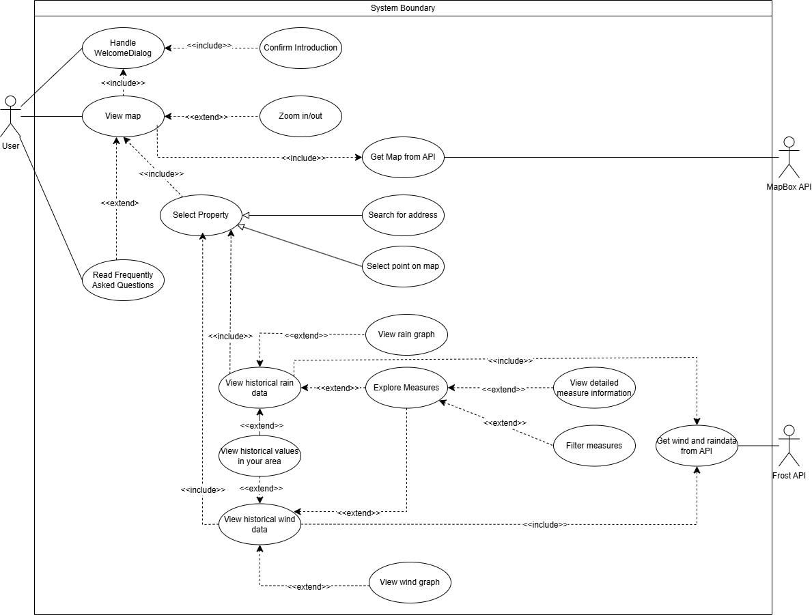
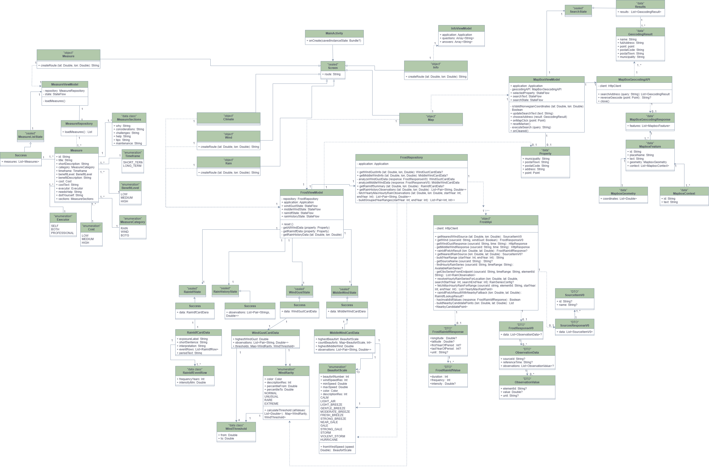

# Modeling
## Use case diagram
This shows the most important functions of the app and their dependencies.


## Activity Diagram
To show how the user navigates the app to find measures that suit their situation, we have chosen to present it through an activity diagram. 

Name: Filter and view detailed measure information

Precondition: The app is started and the user is on the map screen. 
Postcondition: The user has read detailed information about a relevant measure

Main flow:  
1. The user pulls up or clicks on the menu (bottom sheet).
2. The system expands the menu (bottom sheet) with navigation options. 
3. The user presses "vis anbefalte tiltak".
4. The system navigates to the measures page.
5. The user selects one or more filters.
6. The system updates the list and shows only measures that match the filters.
7. The user scrolls through the filtered list.
8. The user clicks on a specific measure card. 
9. The system displays detailed information about the measure. 
10. The user navigates back to the filtered list. 

Alternative flow: 
  1.1 The user has selected an address and is viewing specific climate data (e.g., rain data). 
  
  1.2 The user presses the “tiltak” button. 
  
  1.3 The system navigates to the measures screen with the relevant filter (e,g., "regn") already activated. 
  
  1.4 The system displays the pre-filtered list.  
  
  1.5 Flow continues at point 5

```mermaid
flowchart TD
    Start([Start]) --> UserAtMap[User is on the Map Screen]
    
    UserAtMap --> Entry{Choose Entry Path}

    %% Inngangsporter
    Entry -->|Manual Path| OpenSheet[User opens the Bottom Sheet menu]
    OpenSheet --> ClickMeasures[User clicks Show recommended measures]
    ClickMeasures --> ViewAll[System shows all available measures]

    Entry -->|From Analysis| ViewClimate[User is viewing Rain or Wind data]
    ViewClimate --> ClickAuto[User clicks Measures button]
    ClickAuto --> ViewPreFiltered[System shows measures pre-filtered by category]

    %% Felles flyt videre
    ViewAll --> FilterDecision
    ViewPreFiltered --> FilterDecision

    FilterDecision{User wants to refine list?}

    FilterDecision -->|Yes| SelectFilters[User adjusts filter criteria]
    SelectFilters --> ListUpdates[System updates list immediately]
    ListUpdates --> FilterDecision

    %% Se detaljer
    FilterDecision -->|No| BrowseList[User browses the filtered list]
    
    BrowseList --> DetailDecision{Read more about a specific measure?}
    
    DetailDecision -->|Yes| ClickMeasure[User clicks on a measure card]
    ClickMeasure --> ShowDetails[System displays detailed information]
    ShowDetails --> BackToList[User clicks back]
    BackToList --> BrowseList

    DetailDecision -->|No| End([End])

````

## Sequence Diagram
To show how the user navigates to the rain data page and how the system retrieves data, we have chosen to present it through a sequence diagram.

Name: View historical rain data 

Precondition: The app is started and the user is on the map screen. 

Postconditions: User is on the historical rain data page and sees the graph and intensities.

Main flow:  
1. User searches for an address in the search field
2. The system shows suggested addresses based on input
3. User selects the desired address from the list
4. The system zooms in on the selected location and places a marker
5. The system automatically retrieves climate data from the API for the selected location
6. The system expands the menu (bottom sheet) with options for the selected address
7. User presses “Vis regndata”
8. The system navigates to the rain data page
9. User is on the historical rain data page.

Alternative flow:
1.1 User presses a point directly on the map
1.2 The system identifies the nearest address for the point and marks it
1.3 The flow continues from step 4

```mermaid

sequenceDiagram
    autonumber
    actor User
    participant SearchBar as SearchBar (UI)
    participant MapUI as MapScreen (UI)
    participant MapVM as MapboxViewModel
    participant FrostVM as FrostViewModel
    participant API as External APIs (Mapbox/Frost)
    participant Nav as NavController

    User->>SearchBar: Input address text
    SearchBar->>MapVM: updateSearchText(text)
    MapVM->>API: Request address suggestions
    API-->>MapVM: Return list of properties
    MapVM-->>SearchBar: Display suggestions
    User->>SearchBar: Select property from list
    SearchBar->>MapVM: chooseAddress(property)
    MapVM-->>MapUI: Update selectedProperty state

    rect rgb(255, 255, 255)
    alt Alternative Flow: Direct Map Interaction
      User->>MapUI: Tap directly on map
      MapUI->>MapVM: onMapClick(point)
      MapVM->>API: Reverse Geocoding (get address)
      API-->>MapVM: Return property info
      MapVM-->>MapUI: Update selectedProperty state
    end

    Note over MapUI, FrostVM: Automatic System Actions (LaunchedEffect)
    MapUI->>MapUI: mapViewportState.easeTo(location, zoom)
    par Background Data Fetching
        MapUI->>FrostVM: getRainIdfData(property)
        FrostVM->>API: Fetch Rain Data
        API-->>FrostVM: Rain Data Received
    and 
        MapUI->>FrostVM: getAllWindData(property)
        FrostVM->>API: Fetch Wind Data
        API-->>FrostVM: Wind Data Received
    and UI Animation
        MapUI->>MapUI: delay(500)
        MapUI->>MapUI: sheetState.bottomSheetState.expand()
    end

    User->>MapUI: Click "View Rain Data"
    MapUI->>Nav: navigate(Screen.Rain.route)
    Nav-->>User: Displays RainScreen
  end
````
## Class diagram
We have created a class diagram to showcase the various classes in the app and how they relate to one another.


